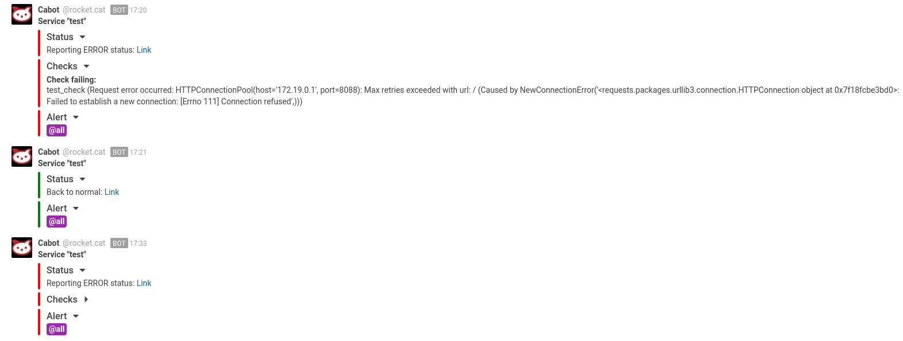

Cabot RocketChat Plugin
#######################

.. image:: https://travis-ci.org/ObjectifLibre/cabot-alert-rocketchat.svg?branch=master
    :target: https://travis-ci.org/ObjectifLibre/cabot-alert-rocketchat

Based on Cabot Hipechat Plugin (https://github.com/cabotapp/cabot-alert-hipchat).

This is an alert plugin for the cabot service monitoring tool. It allows you to alert users in a RocketChat channel.

Installation
------------

* pip

  .. code-block:: console

      pip install cabot-alert-rocketchat

Dev environment
---------------

TODO

Configuration
-------------

* The plugin use Rocketchat webhooks (https://rocket.chat/docs/administrator-guides/integrations/)
* Enable rocketchat plugin on cabot:

    .. code-block:: console

        # Plugins to be loaded at launch
        CABOT_PLUGINS_ENABLED=...,cabot_alert_rocketchat

* Configuration available:

    * Common:

      .. code-block:: console

          # Channel used to publish messages
          ROCKETCHAT_CHANNEL=#support
          # Webhook URL with token
          ROCKETCHAT_WEBHOOK_URL=http://rocketchat.example.org/hooks/TOKEN
          # Username for messages. This username does not need to
          # exist on your Rocketchat, this is an alias.
          ROCKETCHAT_USERNAME=Cabot

    * Message format:

      .. code-block:: console

          # Collapse Service part
          ROCKETCHAT_COLLAPSED_SERVICE=False
          # Collapse Checks part
          ROCKETCHAT_COLLAPSED_CHECKS=False
          # Collapse Alert part
          ROCKETCHAT_COLLAPSED_ALERT=False

Example
-------

